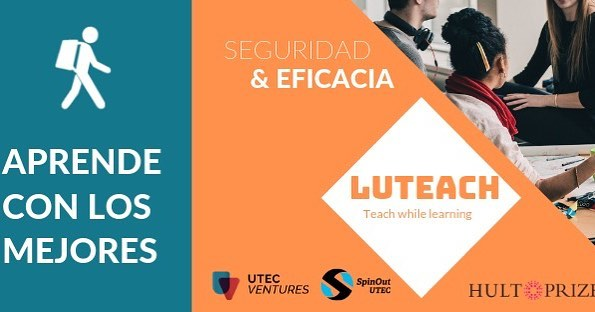

# Proyecto de Desarrollo Basado en Plataformas
En este proyecto realizamos la página web de un start up, acá de UTEC, llamado Luteach, el cual es un proyecto que alumnos de la universidad UTEC dan clases a quien necesite refuerzo en cursos de ciencias como Matemática, Física entre otros.

En esta página web hay dos entradas: para el alumno y el profesor. Si el alumno ingresa a su cuenta puede reservar su clase indicando el lugar, cantidad de horas, fecha y número de alumnos. Estos datos se almacenarán en una base de datos que esta enlazada con la página web.

Asimismo, esta página contiene información acerca de Luteach, como por ejemplo algunas experiencias de los integrantes de este, así como algunas de las personas que participan como profesores de este. 

